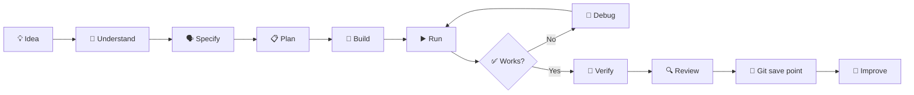

# 🚀 Connor Coding Lab — Mission Control

Hi Connor.

This is the front door to your coding environment.

You are learning to become an **AI-native developer**. That does not mean spending your time typing hundreds of lines because developers used to do everything manually.

Your job is to learn how to:

- 💡 decide what should be built;
- 🧠 understand the important ideas;
- 🗣️ explain clearly what you want an AI coding agent to do;
- 🔍 inspect what changed;
- ▶️ run the software;
- 🧪 prove whether it works;
- 🐛 investigate what went wrong;
- 💾 understand what Git recorded;
- 🚀 improve the project.

Antigravity can do substantial implementation work. You still need enough understanding to direct it and check whether the result is actually good.

---

## 🧭 Where am I?

You are in **Connor Coding Lab Mission Control**.

This repository is gradually becoming the control centre for:

- your missions;
- your learning roadmap;
- short practice challenges;
- your progress;
- Antigravity's teaching system;
- links to your real project repositories.

Python Basics and Snake are separate Git repositories and the Phase 9 cockpit brings them into the same VS Code workspace without submodules.

---

## ✅ What is real right now?

| Area | Current state |
| --- | --- |
| Python Basics | ✅ Independent Git repository |
| Snake Game | ✅ Independent Git repository |
| Neon City technology preview | ✅ AI-built showcase |
| Snake: OVERDRIVE | ✅ AI-built showcase |
| Your real Neon City project | ⏳ Not created yet |
| V2 Antigravity mentor system | ✅ Accepted and merged |
| V2 master progress tracker | ✅ Accepted and merged |
| V2 VS Code learner cockpit | ✅ Accepted and merged |
| V2 mission library | ✅ Accepted and merged |
| V2 lab control command | ✅ Accepted and merged |
| V2 safety / CI | ✅ Accepted, merged and protected |
| Historical project extraction | ✅ Phase 8 complete |
| Multi-repository cockpit | ✅ Phase 9 accepted on ThinkPad |

A preview is not the same thing as your own project.

When your real Neon City begins, **you** decide its world, mechanics, characters, missions and direction.

---

## 🖥️ Open your cockpit

The canonical learner workspace is:

`Connor-Coding-Lab.code-workspace`

Open that workspace in VS Code.

You should then have:

- **Mission Control** — learning/navigation/control-plane material;
- **Python Basics** — your current Python learning project;
- **Snake Game** — your historical game project;
- **Antigravity** — your mentor/coding agent;
- **Source Control** — Git changes and history;
- **Integrated Terminal** — your real shell, available from the workspace.

The workspace opens a neutral Mission Control terminal automatically in a trusted workspace. It does **not** silently activate a project `.venv`; project commands use `uv run ...` explicitly.

The Phase 6 learner control command is:

```bash
./scripts/lab help
```

It can show status/projects, run known targets, perform a read-only doctor check and provide inspection-only Git shortcuts. It prints the real delegated command before execution.

The older `./scripts/run-lab.sh` command remains as a compatibility menu.

---

## 🎯 Current missions

The V2 mission catalogue now lives at:

[`missions/`](missions/)

It contains one bounded starter mission for each major track plus a cross-track first evidence cycle.

The older files under [`00-CONNOR-HQ/`](00-CONNOR-HQ/) remain preserved as historical material, but they are no longer the canonical V2 mission catalogue.

Antigravity should use your master tracker plus current project interests to choose a useful mission rather than forcing a rigid lesson order.

---

## 🤖 Working with Antigravity

When you want to build something, a strong request explains four things:

1. **WHAT** do I want?
2. **WHY** do I want it?
3. **WHAT MUST NOT CHANGE?**
4. **HOW WILL WE KNOW IT WORKED?**

Example:

> I want the Snake game to show a three-second countdown before play starts. Keep the existing movement controls unchanged. Make a plan before changing code. After the change, show me how we can prove the countdown and controls both work.

That is more useful than:

> Make Snake better.

You will learn more advanced AI collaboration as you progress.

---

## 🔁 The development loop



---

## 🧠 Five questions you should increasingly be able to answer

For important work:

1. What are we trying to build?
2. Where does the important code live?
3. How do I run it?
4. How do I know it works?
5. What did Git record?

You do not need to know every answer immediately. Antigravity's job is to help you reach the point where the important parts make sense.

---

## 🗂️ Mission Control areas

- [`missions/`](missions/) — things to do and build.
- [`learning/`](learning/) — the concepts and roadmap behind the missions.
- [`practice/`](practice/) — small experiments where mistakes are expected.
- [`progress/CONNOR-MASTER-TRACKER.md`](progress/CONNOR-MASTER-TRACKER.md) — the canonical record of what you can explain, use, direct and verify.
- [`showcase/`](showcase/) — reference work built mainly by AI.
- **Python Basics workspace root** — independent historical Python learning repository.
- **Snake Game workspace root** — independent historical game repository.

---

## 🛡️ System changes

Normal coding should not need administrator privileges.

If something requires `sudo`, account changes, system packages or other machine-wide changes, that is a different kind of operation. Antigravity should explain what is needed and use the approved maintenance process rather than treating administrator access as normal coding.

---

## ⚡ Fast start

Your normal start is:

1. open `Connor-Coding-Lab.code-workspace`;
2. use `/start` in Antigravity;
3. let the tracker and mission catalogue guide one bounded next mission;
4. use the integrated terminal and visible tasks to run/test;
5. inspect Git before saving progress;
6. use `/finish` after meaningful work so only evidence-supported progress is recorded.

If the cockpit, mission instructions or actual repository state disagree, stop and inspect the current files rather than guessing.
