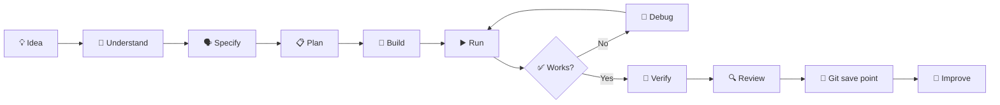

# 🚀 Connor Coding Lab — Mission Control

Hi Connor.

This is the front door to your coding environment.

You are learning to become an **AI-native developer**. That does not mean spending your time typing hundreds of lines because developers used to do everything manually.

Your job is to learn how to:

- 💡 decide what should be built;
- 🧠 understand the important ideas;
- 🗣️ explain clearly what you want an AI coding agent to do;
- 🔍 inspect what changed;
- ▶️ run the software;
- 🧪 prove whether it works;
- 🐛 investigate what went wrong;
- 💾 understand what Git recorded;
- 🚀 improve the project.

Antigravity can do substantial implementation work. You still need enough understanding to direct it and check whether the result is actually good.

---

## 🧭 Where am I?

You are in **Connor Coding Lab Mission Control**.

This repository is gradually becoming the control centre for:

- your missions;
- your learning roadmap;
- short practice challenges;
- your progress;
- Antigravity's teaching system;
- links to your real project repositories.

Your bigger projects will eventually live as separate Git repositories while still appearing together in one development workspace.

---

## ✅ What is real right now?

| Area | Current state |
| --- | --- |
| Python Basics | ✅ Existing learning project |
| Snake Game | ✅ Existing historical project |
| Neon City technology preview | ✅ AI-built showcase |
| Snake: OVERDRIVE | ✅ AI-built showcase |
| Your real Neon City project | ⏳ Not created yet |
| V2 Antigravity mentor system | ✅ Accepted and merged |
| V2 master progress tracker | 🧪 Phase 3 candidate — implemented, awaiting behavioural acceptance |
| V2 mission library | 🚧 Being built |

A preview is not the same thing as your own project.

When your real Neon City begins, **you** decide its world, mechanics, characters, missions and direction.

---

## ▶️ Start the current lab

Open the terminal in this repository and run:

```bash
./scripts/run-lab.sh
```

That launches the current accepted games and tools while Mission Control V2 is being built.

---

## 🎯 Current missions

During the transition, the existing missions remain here:

[`00-CONNOR-HQ/`](00-CONNOR-HQ/)

The new mission system will live under:

[`missions/`](missions/)

Do not worry if that area is still small. It is being built deliberately rather than filled with pretend lessons.

---

## 🤖 Working with Antigravity

When you want to build something, a strong request explains four things:

1. **WHAT** do I want?
2. **WHY** do I want it?
3. **WHAT MUST NOT CHANGE?**
4. **HOW WILL WE KNOW IT WORKED?**

Example:

> I want the Snake game to show a three-second countdown before play starts. Keep the existing movement controls unchanged. Make a plan before changing code. After the change, show me how we can prove the countdown and controls both work.

That is more useful than:

> Make Snake better.

You will learn more advanced AI collaboration as you progress.

---

## 🔁 The development loop



---

## 🧠 Five questions you should increasingly be able to answer

For important work:

1. What are we trying to build?
2. Where does the important code live?
3. How do I run it?
4. How do I know it works?
5. What did Git record?

You do not need to know every answer immediately. Antigravity's job is to help you reach the point where the important parts make sense.

---

## 🗂️ Mission Control areas

- [`missions/`](missions/) — things to do and build.
- [`learning/`](learning/) — the concepts and roadmap behind the missions.
- [`practice/`](practice/) — small experiments where mistakes are expected.
- [`progress/CONNOR-MASTER-TRACKER.md`](progress/CONNOR-MASTER-TRACKER.md) — the canonical record of what you can explain, use, direct and verify.
- [`showcase/`](showcase/) — reference work built mainly by AI.
- `python-basics/` — existing historical learning work.
- `snake-game/` — existing historical project.

---

## 🛡️ System changes

Normal coding should not need administrator privileges.

If something requires `sudo`, account changes, system packages or other machine-wide changes, that is a different kind of operation. Antigravity should explain what is needed and use the approved maintenance process rather than treating administrator access as normal coding.

---

## 🏁 For now

Explore the current lab, existing missions and projects.

Mission Control V2 is being assembled in stages so that when it becomes your normal environment, the pieces are real, tested and understandable.
